# Kafka Partition Scaler

<div style="text-align:center">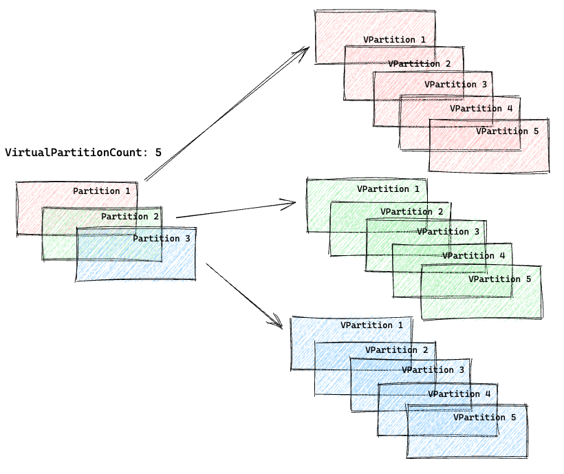</div>

##### Table of Contents

1. [Why Did We Create This Extension?](#why-did-we-create-this-extension)
2. [Goals of the Library](#goals-of-the-library)
3. [How does it work?](#how-does-it-work)
4. [Load Test](#load-test)
5. [Installation](#installation)
6. [Cluster Config](#cluster-config)
7. [Consumer Group Config](#consumer-group-config)
8. [Consumer Example](#consumer-example)
9. [Batch Consumer Example](#batch-consumer-example)
10. [Consumer Initializer Example](#consumer-initializer-example)
11. [Consumer Interceptor Example](#consumer-interceptor-example)
12. [Producer Topic Config](#producer-topic-config)
13. [Producer Initializer Example](#producer-initializer-example)
14. [Producer Interceptor Example](#producer-interceptor-example)
15. [Examples](examples)
16. [On Production](#on-production)

## Why Did We Create This Extension?

When using the Sarama client, it provides a channel for each partition of a topic. However, when using the Segment.io
client, it provides only one channel for a consumer group.

We consume approximately 100-150 million messages daily, and when using the existing clients directly, we were unable to
consume messages at the desired rate. As a result, we initially tried various methods to address this issue:

1. Initially, we attempted to pull messages from the channel provided by the client up to a predetermined size and then
   processed these messages in parallel threads, followed by an `awaitAll`. However, this approach caused us to lose the
   order of messages.

2. In our second attempt, to maintain message order, we pulled messages from the channel up to a specified size, and
   then grouped the messages by key. Each group was processed by parallel threads, followed by an `awaitAll`. However,
   this implementation proved to be less than ideal.

Considering that our existing implementations were not efficient, we decided to create a wrapper library for a new
Sarama client

## Goals of the Library

- Messages should be processed without waiting and should be processed in parallel.
- While processing in parallel, the order of messages should not be lost.
- We should consume and produce on multiple cluster easily.
- The library should be extendable, allowing for the rapid addition of new features.
- We should implement our application easily
- We are able to write custom retry or default retry consumer for each consumer group
- We can use scheduled custom error topic or default error topic consumer instead of shovel vb.. applications
- We are able to produce our message to kafka easily
- We should support single message, unique messages or batch messages consumer

This library was developed with the above objectives in mind, addressing the challenges we faced with existing Kafka
clients and enabling efficient and scalable message consumption.

### Installation

```sh
...loading...
```


### Cluster Config

You can define cluster config, we can support multi-cluster. We can also support the auth mechanism.

kafka-cluster-config.yaml

```yaml
stage:
  cluster1:
    clientId: "kafka-partition-scaler-example"
    brokers:
      cluster1-broker1,
      cluster1-broker2,
    version: "2.2.0"
    errorConfig:
      groupId: "product.kafka-partition-scaler.error-consumer.0"
      cron: "0 */5 * * *"
      maxErrorCount: 3
      closeConsumerWhenThereIsNoMessage: "10m"
      closeConsumerWhenMessageIsNew: "20m"
      maxProcessingTime: "10s"
    producerConfig:
      requiredAcks: "WaitForLocal"
      timeout: "5s"
  cluster2:
    clientId: "kafka-partition-scaler-example"
    brokers:
      cluster2-broker1,
      cluster2-broker2,
    version: "2.2.0"
    errorConfig:
      groupId: "product.kafka-partition-scaler.error-consumer.0"
      cron: "0 */5 * * *"
      maxErrorCount: 3
    auth:
      username: "username"
      password: "password"
      certificates:
        - "ca.pem"
```

You can set the error config, if you don't set it, the error consumer won't be enabled.

You can set the producer config if you want. Producer Config will be default for the cluster.

Cluster Config:

<details>

|                   Properties                    |                                                                                                                                              Description                                                                                                                                               | Default      |
|:-----------------------------------------------:|:------------------------------------------------------------------------------------------------------------------------------------------------------------------------------------------------------------------------------------------------------------------------------------------------------:|:-------------|
|                   `clientId`                    |                                                                                                                                it needs to track consumer group clients                                                                                                                                |              |
|                    `brokers`                    |                                                                                                                                            cluster brokers                                                                                                                                             |              |
|                    `version`                    |                                                                                                                                         kafka cluster version                                                                                                                                          |              |
|              `errorConfig.groupId`              |                                                                                                                                 consumer group id for all error topic                                                                                                                                  |              |
|               `errorConfig.cron`                |                                                                                                                                     error consumer start interval                                                                                                                                      |              |
|           `errorConfig.maxErrorCount`           |                                                                                                                   we calculate how many times it occurred from retry to error topic                                                                                                                    | 1sn          |
| `errorConfig.closeConsumerWhenThereIsNoMessage` |                                                                                                                        if the error consumer has no lag, we close the consumer                                                                                                                         | 5m           |
|   `errorConfig.closeConsumerWhenMessageIsNew`   |                                                                                          if the consumed message is new, we close the consumer to avoid infinite loops, retry -> error -> retry -> error case                                                                                          | 5m           |
|         `errorConfig.maxProcessingTime`         |                                                                                                                  we cancel thread context when processing exceeds max processing time                                                                                                                  | 1s           |
|           `errorConfig.offsetInitial`           |                                                                                                                                          todo offset initial                                                                                                                                           | oldest       |
|          `producerConfig.requiredAcks`          |                                                                                The level of acknowledgement reliability needed from the broker. Equivalent to the `request.required.acks` setting of the JVM producer.                                                                                 | WaitForLocal |
|            `producerConfig.timeout`             | The maximum duration the broker will wait the receipt of the number of RequiredAcks. This is only relevant when RequiredAcks is set to WaitForAll or a number > 1. Only supports millisecond resolution, nanoseconds will be truncated. Equivalent to the JVM producer's `request.timeout.ms` setting. | 10s          |
|        `producerConfig.maxMessageBytes`         |                                                                                           The maximum permitted size of a message. Should be set equal to or smaller than the broker's `message.max.bytes`.                                                                                            | 1mb          |
|          `producerConfig.compression`           |                                                                                                                      it's default none you can select gzip, snappy, lz4 or zstd.                                                                                                                       | none         |

</details>

### Consumer Group Config

You can define consumer topic config, also select in which [cluster](#cluster-config) your topic
and [listener type](#listeners)

consumer-group-config.yaml

```yaml
consumer:
  groupId: product.kafka-partition-scaler-example.topic.0.single
  name: product.kafka-partition-scaler-example.topic.0
  retry: product.kafka-partition-scaler-example.0.single.retry.0
  error: product.kafka-partition-scaler-example.error.0
  maxProcessingTime: "1s"
  retryCount: 3
  cluster: "cluster1"
  virtualPartitionCount: 10
batchConsumer:
  groupId: product.kafka-partition-scaler-example.topic.0.batch
  name: product.kafka-partition-scaler-example.topic.0
  retry: product.kafka-partition-scaler-example.0.batch.retry.0
  error: product.kafka-partition-scaler-example.error.0
  maxProcessingTime: "1s"
  retryCount: 3
  cluster: "cluster2"
  virtualPartitionCount: 10
  batchSize: 30
  consumeBatchListenerLatency: "2s"
uniqueConsumer:
  groupId: product.kafka-partition-scaler-example.topic.0.unique
  name: product.kafka-partition-scaler-example.topic.0
  retry: product.kafka-partition-scaler-example.0.unique.retry.0
  error: product.kafka-partition-scaler-example.error.0
  maxProcessingTime: "1s"
  retryCount: 3
  cluster: "cluster2"
  virtualPartitionCount: 10
  batchSize: 30
  consumeBatchListenerLatency: "2s"
  uniqueListener: true
```

Consumer Group Config:

<details>

|          Properties           |                                                                                                                                                           Description                                                                                                                                                           | Default      |
|:-----------------------------:|:-------------------------------------------------------------------------------------------------------------------------------------------------------------------------------------------------------------------------------------------------------------------------------------------------------------------------------:|:-------------|
|           `groupId`           |                                                                                                                                                        consumer group id                                                                                                                                                        |              |
|            `name`             |                                                                                                                                                              topic                                                                                                                                                              |              |
|            `retry`            |                                                                                                                                                           retry topic                                                                                                                                                           |              |
|            `error`            |                                                                                                                                                           error topic                                                                                                                                                           |              |
|         `retryCount`          |                                                                            if an error occurs on our topic, we send a message to retry the topic, so how many times will be retried, If you set 0, the error message moves the error topic directly                                                                             |              |
|           `cluster`           |                                                                                                                                           we select cluster from cluster-config.yaml                                                                                                                                            |              |
|    `virtualPartitionCount`    |                                          how many do we parallel our consumers, for example, we have a topic that has 3 partitions, if we set 10 virtual partitions, we will process 30 parallel threads. If you don't set a virtual partition, you will use the core Sarama consumer                                           | 0            |
|  `virtualPartitionChanCount`  | if our messages generally have the same key, we should increase `virtualPartitionChanCount`, because when we distribute messages to the virtual partition channel, we use the message key. If we consume the same key events, we won't publish the virtual partition channel, because the channel would be filled, we must wait | 75           |
|          `batchSize`          |                                                                                                                how many messages do we fetch from our topic, you must implement `partitionscaler.BatchConsumer`                                                                                                                | 0            |
|       `uniqueListener`        |                                                                                              we fetch messages up to batchSize, we ignore the duplicate messages and process the latest message, default false, required batchSize                                                                                              |              |
| `consumeBatchListenerLatency` |                                                                                    how much time do we wait to fill the batch messages list, if the list does not have enough messages, we will process them immediately, required batchSize                                                                                    | 3s           |
|      `maxProcessingTime`      |                                                                                                                              we cancel thread context when processing exceeds max processing time                                                                                                                               | 1s           |
|        `fetchMaxBytes`        |                The default number of message bytes to fetch from the broker in each request (default 1MB). This should be larger than the majority of your messages, or else the consumer will spend a lot of time negotiating sizes and not actually consuming. Similar to the JVM's `fetch.message.max.bytes`.                | 1mb          |
|    `disableErrorConsumer`     |                                                                                                                                   if you don't want to use error consumer, you can set false                                                                                                                                    |              |
|        `offsetInitial`        |                                                                                                                                             should be OffsetNewest or OffsetOldest                                                                                                                                              | OffsetNewest |
|       `sessionTimeout`        |                                   The consumer sends periodic heartbeats to indicate its liveness to the broker. If no heartbeats are received by the broker before the expiration of this session timeout, then the broker will remove this consumer from the group and initiate a rebalance                                   | 10s          |
|      `rebalanceTimeout`       |  The maximum allowed time for each worker to join the group once a rebalance has begun. This is basically a limit on the amount of time needed for all tasks to flush any pending data and commit offsets. If the timeout is exceeded, then the worker will be removed from the group, which will cause offset commit failures  | 60s          |
|      `heartbeatInterval`      |                                The expected time between heartbeats to the consumer coordinator when using Kafka's group management facilities. Heartbeats are used to ensure that the consumer's session stays active and to facilitate rebalancing when new consumers join or leave the group                                 | 3s           |

</details>

### Consumer Example

Create your consumer, and must implement `partitionscaler.Consumer`

consumer.go

```go
package consumers

import (
	"context"
	"github.com/Trendyol/go-kafka-partition-scaler"
)

type consumer struct{}

func NewConsumer() partitionscaler.Consumer {
	return &consumer{}
}

func (c *consumer) Consume(ctx context.Context, message *partitionscaler.ConsumerMessage) error {
	return nil
}

```

### Batch Consumer Example

Create your batch consumer, and must implement `partitionscaler.BatchConsumer`

batch_consumer.go

```go
package consumers

import (
	"context"
	"github.com/Trendyol/go-kafka-partition-scaler"
)

type batchConsumer struct {
}

func NewBatchConsumer() partitionscaler.BatchConsumer {
	return &batchConsumer{}
}

func (consumer *batchConsumer) Consume(ctx context.Context, messages []*partitionscaler.ConsumerMessage) map[*partitionscaler.ConsumerMessage]error {
	return nil
}
```

You can customize the consumer group, if you don't set retry or error consumer, we will set default retry and error
consumer

```go
    consumersList := []*partitionscaler.ConsumerGroupConsumers{
{
ConfigName:               "consumer",
Consumer:                 consumers.NewConsumer(),
RetryConsumer: // custom RetryConsumer, 
BatchConsumer:            consumers.NewBatchConsumer(),
BatchRetryConsumer:   // custom BatchRetryConsumer,
ErrorConsumer:        // custom BatchRetryConsumer,
ConsumerInterceptors: // specific ConsumerInterceptor,
ConsumerErrorInterceptor: // specific ConsumerErrorInterceptor,
},
}
```

### Consumer Initializer Example

We initialize consumers using [cluster-config.yaml](#cluster-config)
and [consumer-group-config.yaml](#consumer-group-config)

main.go

```go
package main

import (
	"github.com/Trendyol/go-kafka-partition-scaler"
	"kafka-partition-scaler-example/kafka/consumers"
)

func main() {
	clusterConfigMap, err := partitionscaler.ReadKafkaClusterConfig("./resources/kafka-cluster-config.yaml", "stage")
	if err != nil {
		panic(err)
	}
	consumerConfig, err := partitionscaler.ReadKafkaConsumerGroupConfig("./resources/consumer-group-config.yaml")
	if err != nil {
		panic(err)
	}
	consumersList := []*partitionscaler.ConsumerGroupConsumers{
		{ConfigName: "consumer", Consumer: consumers.NewConsumer()},
		{ConfigName: "batchConsumer", BatchConsumer: consumers.NewBatchConsumer()},
	}
	consumerGroups, errorConsumers, err := partitionscaler.NewConsumerBuilder(clusterConfigMap, consumerConfig, consumersList).Initialize()
}
```

### Consumer Interceptor Example

You can create an interceptor.

In generally, we want to fill our context, for example `X-CorrelationId`, `User-Email` vb.. We can get from message
headers.

```go
package interceptors

import (
	"context"
	"github.com/Trendyol/go-kafka-partition-scaler"
)

type consumerInterceptor struct {
}

func NewConsumerInterceptor() partitionscaler.ConsumerInterceptor {
	return &consumerInterceptor{}
}

func (c consumerInterceptor) OnConsume(ctx context.Context, message *partitionscaler.ConsumerMessage) context.Context {
	return ctx
}
```

You can set to a specific consumer

```go
    consumerInterceptor := interceptors.NewConsumerInterceptor()
consumersList := []*partitionscaler.ConsumerGroupConsumers{
{ConfigName: "consumer", ConsumerInterceptors: []*partitionscaler.ConsumerInterceptor{consumerInterceptor}, Consumer: consumers.NewCoreExampleConsumer()}
}
```

or for all consumer

```go
    consumerInterceptor := interceptors.NewConsumerInterceptor()
consumersList := []*partitionscaler.ConsumerGroupConsumers{
{ConfigName: "consumer", Consumer: consumers.NewConsumer()},
}
consumerGroups, errorConsumers, err := partitionscaler.
NewConsumerBuilder(clusterConfigMap, consumerConfig, consumersList).
Interceptor(consumerInterceptor).
Initialize()
```

### Producer Topic Config

You can define your produced topic information, name and cluster. For example, we want to produce product updated event
to topic.

producer-topic-config.yaml

```yaml
productUpdated:
  name: product.updated.0
  cluster: "cluster1"
```

Product Topic Config:

<details>

| Properties |     Description     |
|:----------:|:-------------------:|
|   `name`   | producer topic name |
| `cluster`  |    cluster name     |

</details>

### Producer Event Example

For example, we have an event model `ProductUpdatedEvent` and implement `partitionscaler.Message` interface.

- `GetConfigName() string` should return producer topic config name
- `GetKey() string` should return message key

and then you can produce your event quickly.

event-model.go

```go
package model

import "fmt"

type ProductUpdatedEvent struct {
	Id        int    `json:"id"`
	EventType string `json:"eventType"`
}

func (t *ProductUpdatedEvent) GetConfigName() string {
	return "reindexTopic"
}

func (t *ProductUpdatedEvent) GetKey() string {
	return fmt.Sprint(t.Id)
}
```

Producer knows, this event goes to which cluster and topic from exposed `partitionscaler.Message`.

## Producer Initializer Example

We initialize producer using [cluster-config.yaml](#cluster-config)
and [producer-topic-config.yaml](#producer-topic-config), and we can produce event quickly.

```go
package main

import (
	partitionscaler "gitlab.trendyol.com/product/kafka-partition-scaler"
	"kafka-partition-scaler-example/kafka/interceptors"
)

func main() {
	clusterConfigMap, err := partitionscaler.ReadKafkaClusterConfigWithProfile("./resources/kafka-cluster-config.yaml", "stage")
	if err != nil {
		panic(err)
	}

	//clusterConfigMap, err := partitionscaler.ReadKafkaClusterConfig("./resources/kafka-cluster-config.yaml") // alternative read function
	//if err != nil {
	//	panic(err)
	//}

	producerTopicConfigMap, err := partitionscaler.ReadKafkaProducerTopicConfig("./resources/producer-topic-config.yaml")
	if err != nil {
		panic(err)
	}
	producer, err := partitionscaler.NewProducerBuilderWithConfig(clusterConfigMap, producerTopicConfigMap).Initialize()
	if err != nil {
		panic(err)
	}
	if err := producer.ProduceSync(context.Background(), &model.ProductUpdatedEvent{
		Id:        100,
		EventType: "updated",
	}); err != nil {
		panic(err)
	}

	// There are alternative produce methods
	//producer.ProduceSyncBulk(context.Background(), []partitionscaler.Message{}, 0)
	//producer.ProduceAsync(context.Background(), &model.ProductUpdatedEvent{Id: 100, EventType: "invalidated"})
	//producer.ProduceAsyncBulk(context.Background(), []partitionscaler.Message{})
}
```

#### Producer Interceptor Example

You can create a producer interceptor.

In generally, we want to fill produce message header, for example `X-CorrelationId`, `User-Email` vb.. We can get from
context if context has header values.

```go
package interceptors

import (
	"context"
	"github.com/Trendyol/go-kafka-partition-scaler"
)

type producerInterceptor struct{}

func NewProducerInterceptor() partitionscaler.ProducerInterceptor {
	return &producerInterceptor{}
}

func (p producerInterceptor) OnProduce(ctx context.Context, message *partitionscaler.ProducerMessage) {
}

```

You can set to producer

```go
    producerInterceptor := interceptors.NewProducerInterceptor()

producer, err := partitionscaler.
NewProducerBuilderWithConfig(clusterConfigMap, producerTopicConfigMap).
Log(log).
Interceptor(producerInterceptor).
Initialize()
```

## How does it work?

We create a consumer group and choose which consumer group handler we use

- CustomConsumerGroupHandler(We wrapped sarama client)
- CoreConsumerGroupHandler(default sarama client)

<div style="text-align:center">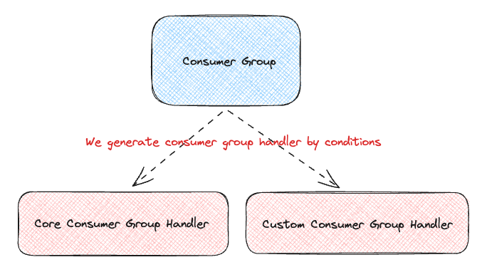</div>


General flow

<div style="text-align:center">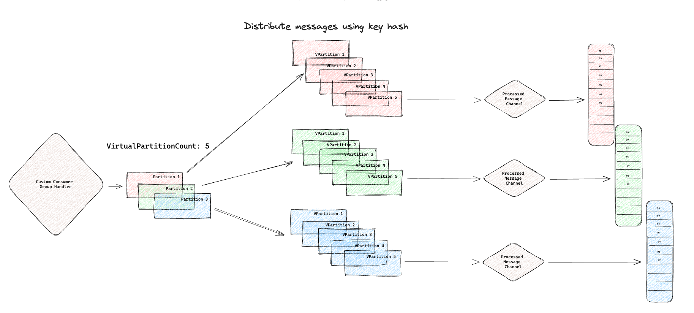</div>

Each consumer group handler has a life cycle

<div style="text-align:center">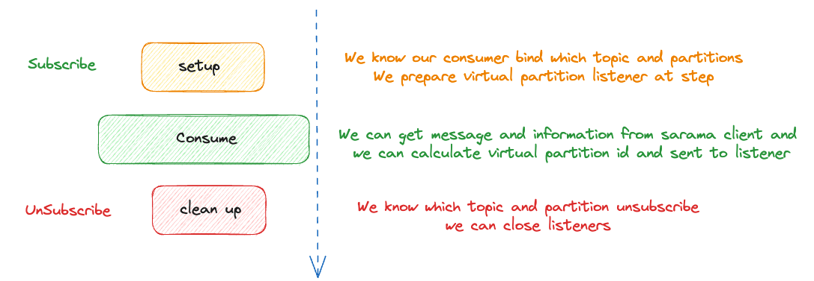</div>

#### Setup

We know our consumer bind which topic and partitions, we are preparing virtual partition listeners at step.

For example, we bind a consumer group, that has a topic and 3 partitions of topic, and virtual partition count: 5, we
will create 3x5=15 **virtual partition channels**, and also we will create a **processed message channel**.

We will create `singleMessageListener`, `batchMessageListener` or `uniqueMessageListener` to listen virtual partition
channel.

We will create `processedMessageListener` to listen processed message channel.

<div style="text-align:center">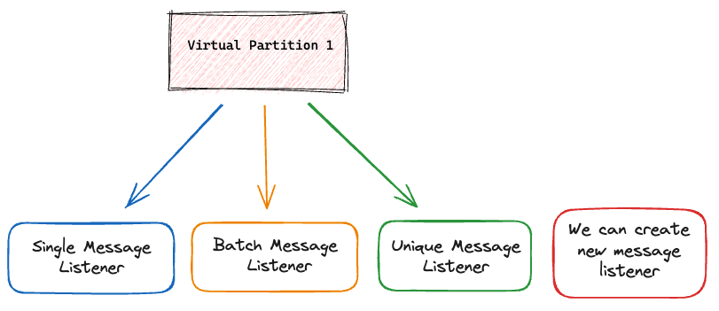</div>

##### Listeners

We create listener for virtual partition channel, We decide to use listener type for our needs.

- singleMessageListener
- batchMessageListener
- uniqueMessageListener
- We can write custom listener

**singleMessageListener**

When receive a message, run a consumer to process this message. The processed message is then sent to the processed
message channel for further actions.

**batchMessageListener**

When receive messages, collect them in a list. When this list reaches a certain size (`batchSize`), we run a bulk
consumer to process these messages. The processed messages are then sent to the processed message channel for further
actions.

However, there are cases where we can't gather enough messages to fill the batch size, causing some messages to wait for
processing. In these situations, has a timer mechanism to periodically(`consumeBatchListenerLatency`) process the
pending messages, ensuring that message backlog is avoided.

**uniqueMessageListener**

When receive messages, collect them in a list. When this list reaches a certain size (`batchSize`), we group the
messages based on their keys. Within each group, we take the most recently received message and deliver it to the
channel that the singleMessageListener is listening to. This way, we ensure that the latest received message is
processed.

However, there are cases where we can't gather enough messages to fill the batch size, causing some messages to wait for
processing. In such cases, has a timer mechanism to periodically(`consumeBatchListenerLatency`) process the pending
messages, ensuring that message backlog is avoided.

**processedMessageListener**

When receive processed message, collect them in a list, listener has a timer mechanism to periodically sort by offset
all processed messages and mark the message to commit

<p float="left">
  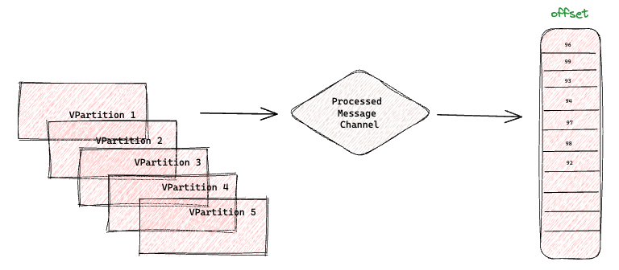
  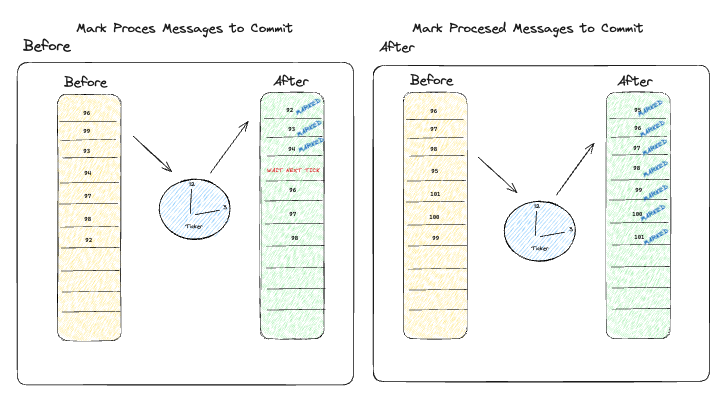
</p>

#### Consume

The Sarama Kafka client gives us a channel for each partition, we can listen to messages from the channel.

We are able to know each message which topic partition also message key, we can calculate the virtual partition id using
key and to publish the virtual partition channel.

`singleMessageListener`,  `batchMessageListener` or `uniqueMessageListener` listen channel and run our consumer function
and then send message to
processed message channel.

#### Clean Up

We know which topic and partition unsubscribe, and we can close  `messageListener`, `batchMessageListener`
and `processedMessageListener`.

## Load Test

We created a `mock http service`, that always returns a response in 20ms.

We have a topic, that has 15 partitions.

<div style="text-align:center">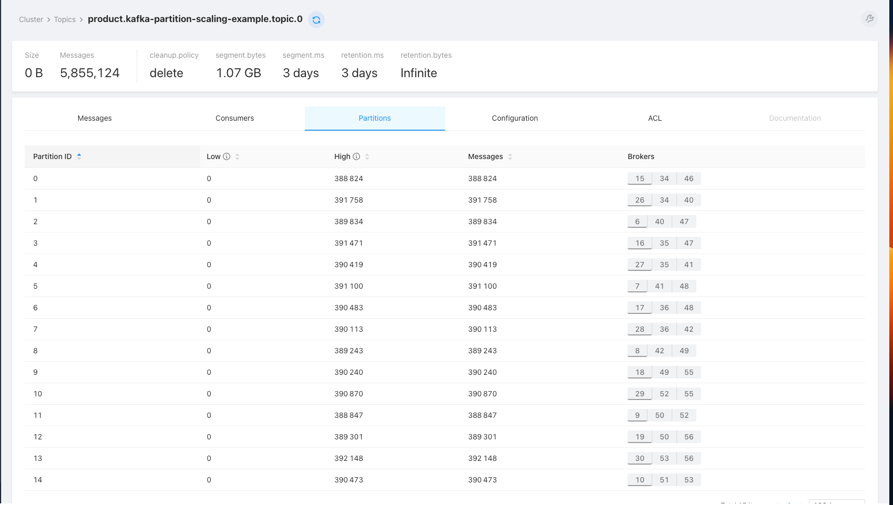</div>

We created an elastic index, and when we consume a message, we will index to elastic.

We produced a lot of messages on topic for a load test.

Scenario:

- We consume a message and marshall to our object
- We call to `mock http service`
- We write to es result and message detail

|        Consumer        | Virtual Partition Count | Batch Size | Newrelic RPM | Elastic RPS | CPU  | Memory |
|:----------------------:|:-----------------------:|:----------:|:------------:|:-----------:|:----:|:-------|
| `core sarama consumer` |            0            |     0      |     40k      |     662     | 0.02 | 41 MiB |
|   `single consumer`    |           20            |     0      |     610k     |    10.6k    | 0.2  | 47 MiB |
|    `batch consumer`    |           10            |     50     |     210k     |    220k     | 0.7  | 60 MiB |

#### Core Sarama Consumer

<p float="left">
  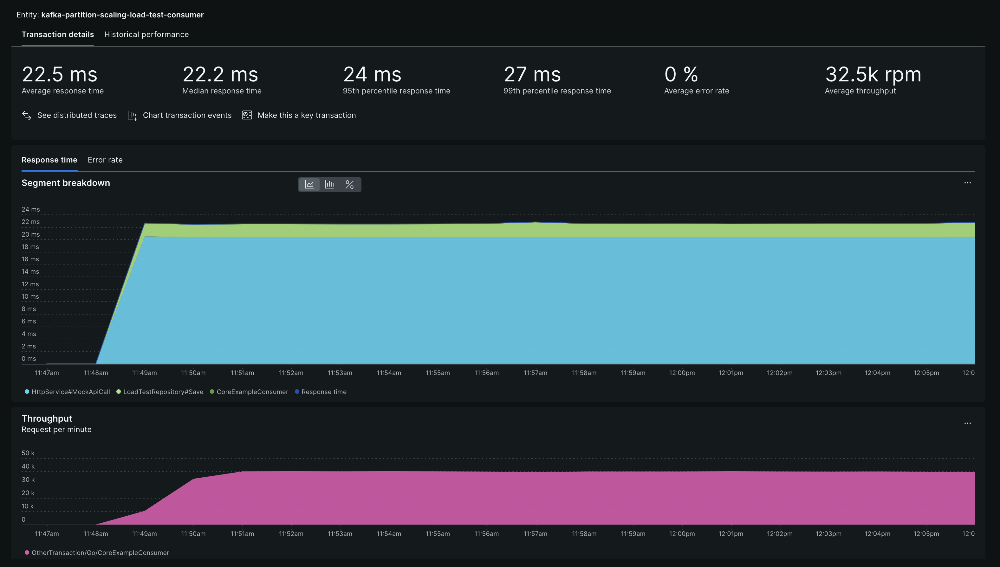
  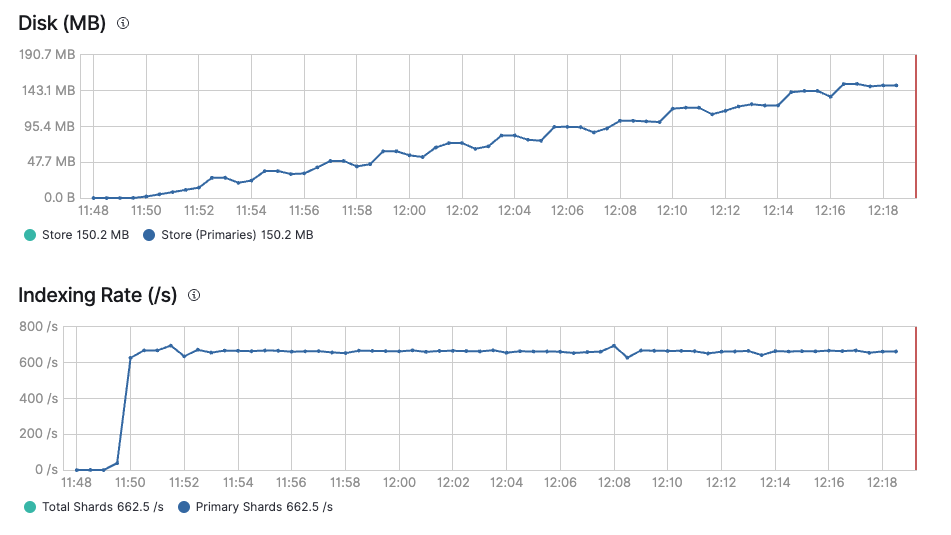
  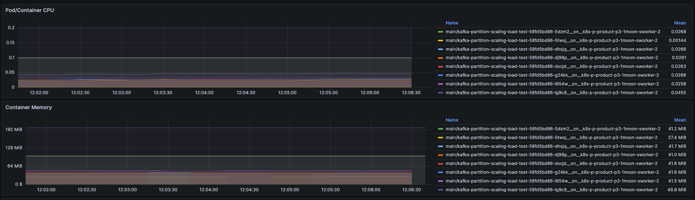
</p>

#### Single Consumer

<p float="left">
  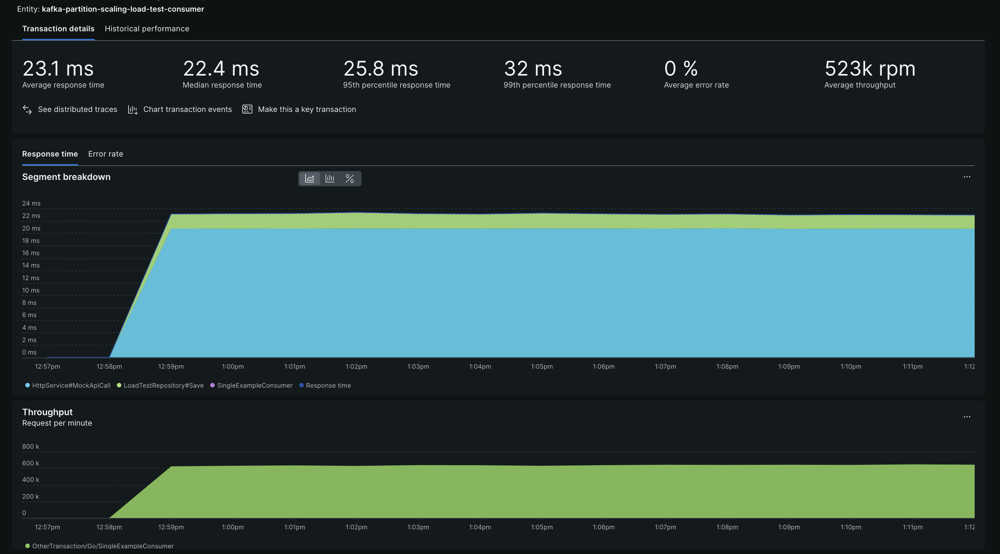
  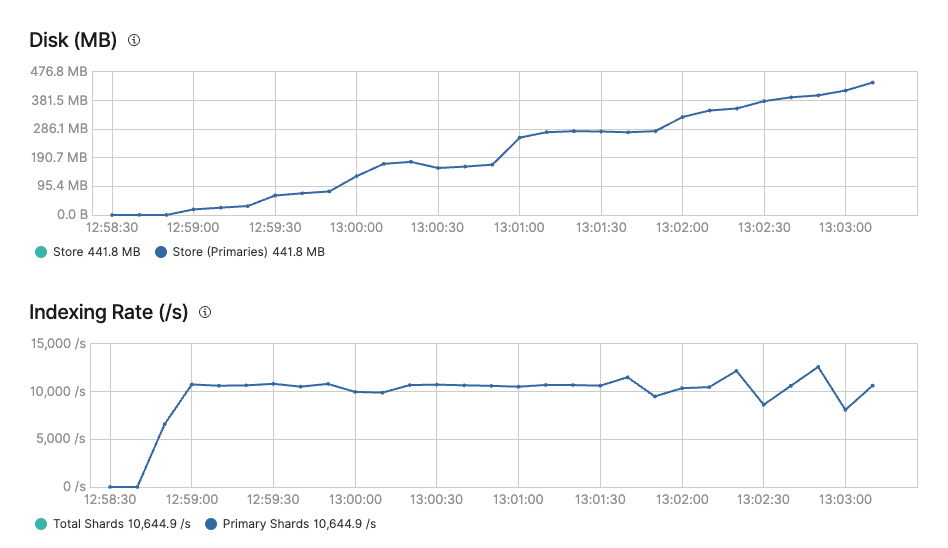
  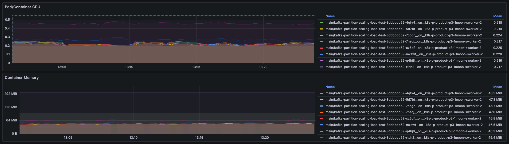
</p>

#### Batch Consumer

<p float="left">
  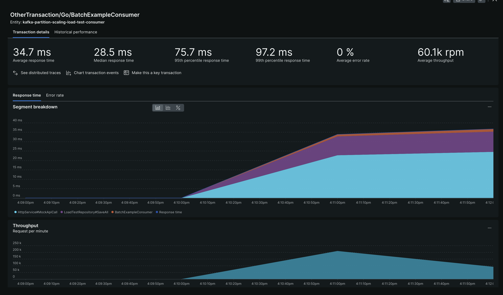
  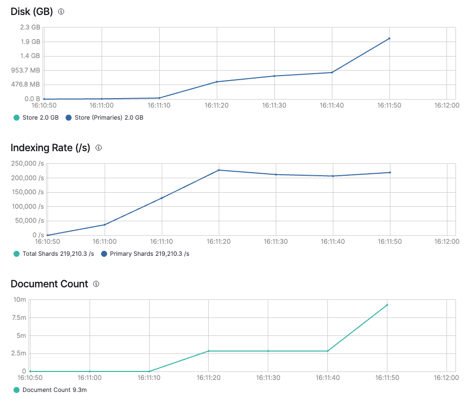
  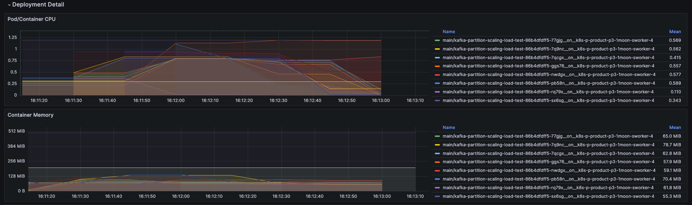
</p>

## On Production

Media Center team using kafka to update their documents, and they need to update document quickly.

They have a topic, that consist 20 partitions, and set 200 virtual partition.

<div style="text-align:center">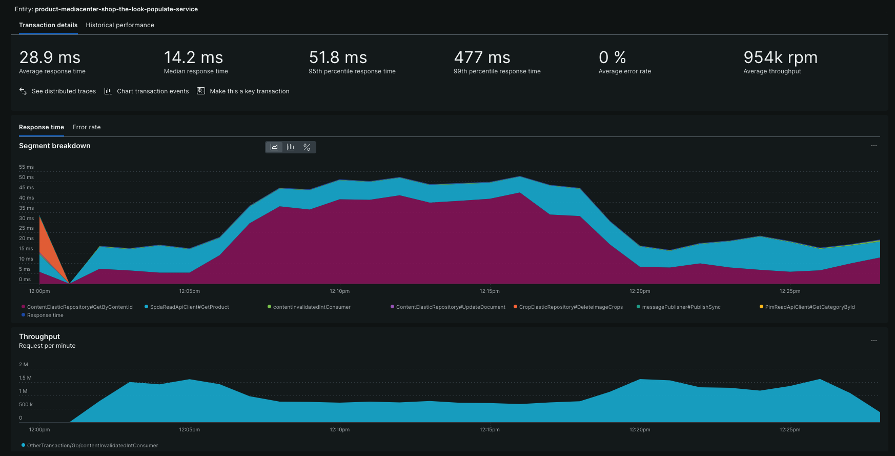</div>
